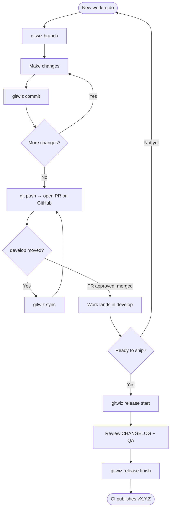
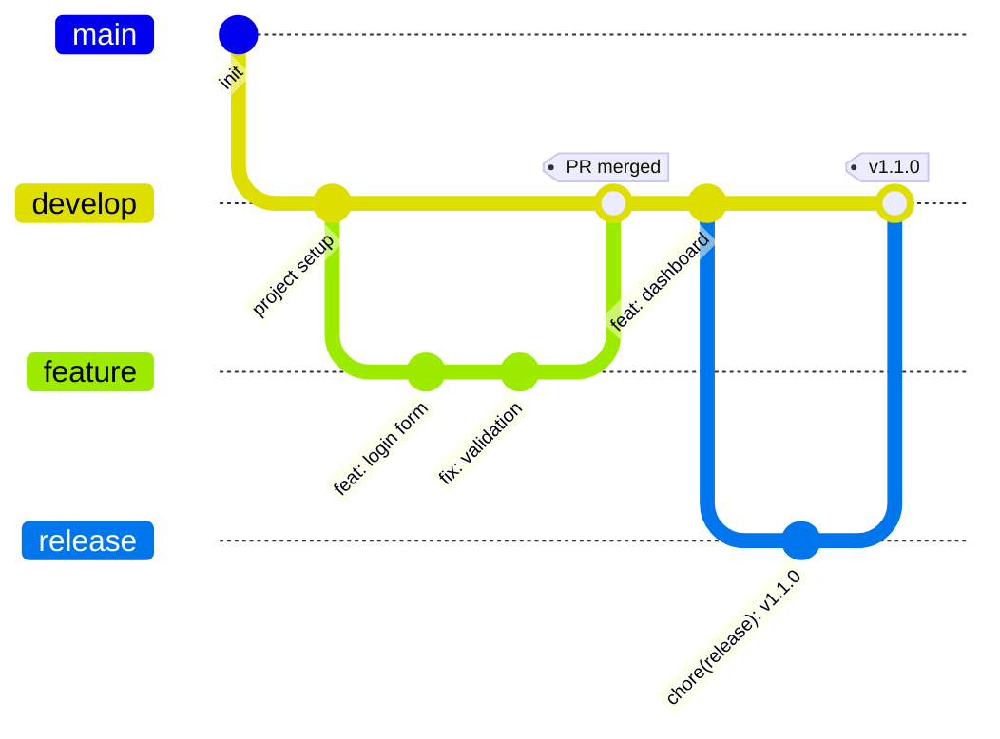

# gitwiz

> Friendly git workflows — interactive wizards for branching, commits, releases, sync, and undo.

**gitwiz** removes the friction of working with git from the terminal. Instead of memorizing commands, you answer simple questions. Every git command gitwiz runs is printed before it executes, so you learn git as you go.

```
$ gitwiz commit
? Type of change: ✨ feat — A new feature
? Scope (optional): auth
? Short description: add password reset flow
┌──────────────────────────────────────┐
│ feat(auth): add password reset flow  │
└──────────────────────────────────────┘
? Create this commit? Yes
  $ git commit -m "feat(auth): add password reset flow"
✔ Commit created.
```

## Install

```bash
npm install -g @fsichi/gitwiz
# or run it without installing:
npx @fsichi/gitwiz status
```

After installing, the command is just `gitwiz` (e.g. `gitwiz status`).

Requires Node.js >= 20 and git. Nothing else — no git-flow binary, no tokens, no setup.

## Commands

Run `gitwiz` on its own (in a terminal) to open an interactive menu listing everything below — handy when you don't remember the exact command. Or call any command directly:

| Command | What it does |
|---|---|
| `gitwiz status` | Where am I and what should I do next? Human-friendly status with suggested next steps. |
| `gitwiz init` | One-time setup: pick your production/work branches and tag prefix. |
| `gitwiz branch` | Start a feature/bugfix/hotfix/refactor branch the right way (updates the base first). |
| `gitwiz commit` | Guided [conventional commit](https://www.conventionalcommits.org): pick files, type, scope, description. |
| `gitwiz sync` | Safely bring the latest changes into your branch (guided merge/rebase, auto-stash). |
| `gitwiz undo` | Undo things without fear: last commit, staged files, local changes — each option explained. |
| `gitwiz release start` | Bump the version, generate/update `CHANGELOG.md` from your commits, open a release branch. |
| `gitwiz release finish` | Merge the release, create the tag, push, clean up. |

### `gitwiz status`

The only non-interactive command (safe in scripts/CI). Shows your branch, how far ahead/behind you are, your files grouped by state, and up to 3 suggested next steps.

### `gitwiz branch`

Asks what kind of work you're starting (feature, bugfix, hotfix, refactor, chore, docs), normalizes the name you type, pulls the latest base branch, creates `feature/<name>` and optionally pushes it. Hotfixes branch off your production branch; everything else off your work branch. Uncommitted changes? It offers to stash and bring them along.

### `gitwiz commit`

If nothing is staged it lets you pick files. Then walks you through type → scope → description → breaking change, previews the message, and commits. Messages follow [Conventional Commits](https://www.conventionalcommits.org), which is what powers the automatic changelog.

### `gitwiz sync`

Fetches, shows how far ahead/behind you are of your base branch, and offers plain-English strategies: merge the base into your branch (safe default), rebase (with a clear warning if the branch is shared), or just update your local base. If a conflict happens, it tells you exactly what to do — it never tries to resolve things for you.

### `gitwiz undo`

A menu of safe undos, each showing the exact git command it will run. Destructive options ask twice and mention `git reflog` as the escape hatch. If the last commit is already pushed, it offers a `git revert` instead of rewriting history.

### `gitwiz release`

`release start` checks nothing else is mid-release, updates your work branch, creates `release/<version>`, bumps `package.json` (and `package-lock.json`), and generates the changelog section from your conventional commits since the last tag — with compare/commit links when your remote is GitHub or GitLab. Review it, then `release finish` merges it back (`--no-ff`), tags `v<version>`, pushes, and deletes the release branch.

The changelog merge is structural: your existing `CHANGELOG.md` preamble (badges, custom intro) is preserved verbatim, old releases are kept, and re-running the same version replaces its section instead of duplicating it. CRLF files stay CRLF.

## Development workflow

gitwiz is built around a simple branch model:

- **`main`** — production. Only release-quality, tagged code lands here.
- **`develop`** — integration. Day-to-day work merges here before it ships.

Work branches are created from `develop` (except `hotfix/`, which branches from `main` to patch production fast). If you prefer **trunk-based** development, set `developBranch` to the same value as `mainBranch` and everything below still works with a single branch.

### Which command do I use?

| Situation | Command |
|---|---|
| First time setting up gitwiz in a repo | `gitwiz init` |
| Starting **any** new work (feature, fix, refactor, chore, docs) | `gitwiz branch` |
| Saving progress as you work | `gitwiz commit` |
| Ready to open a Pull Request | `git push` → open the PR on GitHub |
| `develop` moved while your PR is open | `gitwiz sync` |
| Not sure what's going on / what to do next | `gitwiz status` |
| Made a mistake (bad commit, wrong files, dirty tree) | `gitwiz undo` |
| Time to ship what's on `develop` | `gitwiz release start` → review → `gitwiz release finish` |

### Step by step

1. **Start a branch** — `gitwiz branch`. Pick the kind of work:
   - `feature/`, `bugfix/`, `refactor/`, `chore/`, `docs/` branch off **`develop`**.
   - `hotfix/` branches off **`main`** (urgent production fix).

   gitwiz updates the base branch first, then creates yours and (optionally) pushes it.

2. **Commit as you go** — `gitwiz commit`. It writes [Conventional Commits](https://www.conventionalcommits.org) like `feat:`, `fix:`, `refactor:`. This isn't just style — the commit **type** is what builds your changelog and decides the next version number.

3. **Open a Pull Request** — push your branch (`git push`) and open the PR on GitHub (the push output prints a link). Your team reviews it; on approval it merges into **`develop`**. gitwiz deliberately doesn't manage PRs — GitHub already does that well. gitwiz hands off here and picks back up at release time.

4. **Stay in sync** — if `develop` moves while your PR is open, `gitwiz sync` brings those changes into your branch safely (guided merge or rebase, with auto-stash).

5. **Cut a release** — when `develop` has accumulated enough shipped work:
   - `gitwiz release start` — choose the bump based on what changed since the last release:
     - only `fix:` commits → **patch** (`1.2.3 → 1.2.4`)
     - any `feat:` → **minor** (`1.2.3 → 1.3.0`)
     - a breaking change → **major** (`1.2.3 → 2.0.0`)

     It bumps `package.json`, regenerates `CHANGELOG.md` from your commits, and opens a `release/x.y.z` branch.
   - **Review** the generated changelog, run final QA, and commit any last fixes to the release branch.
   - `gitwiz release finish` — merges the release back, creates the `vX.Y.Z` tag, and pushes. If your CI publishes on tags (see below), the new version ships automatically.

6. **`gitwiz status`** — run it anytime; it tells you where you are and suggests the next step.

> **Where does the release land?** By default gitwiz tags the release on **`develop`** and leaves **`main`** alone — `main` is what you actually deploy to production, updated as a separate step. If you want `release finish` to also merge into `main`, set `"release": { "alsoMergeToMain": true }`.

### What command goes where



### The branch model over time



*(`feature` stands in for `feature/login`, `release` for `release/1.1.0`. A `hotfix/` would branch off `main` instead of `develop`.)*

## Configuration

Run `gitwiz init`, or create `.gitwizrc.json` at your repo root (a `"gitwiz"` key in `package.json` also works):

```json
{
  "mainBranch": "main",
  "developBranch": "develop",
  "tagPrefix": "v"
}
```

Without config, gitwiz auto-detects your branches (`main`/`master`, `develop`/`development`/`dev`). If there is no work branch, it operates trunk-based on your main branch.

<details>
<summary>All options (with defaults)</summary>

```jsonc
{
  "mainBranch": "main",          // production branch
  "developBranch": "develop",    // where work branches start; same as mainBranch = trunk-based
  "tagPrefix": "v",              // release tags: v1.2.3 ("" for bare 1.2.3)
  "branchTypes": [               // what "gitwiz branch" offers
    { "type": "feature", "prefix": "feature/", "description": "New functionality", "base": "develop" },
    { "type": "hotfix",  "prefix": "hotfix/",  "description": "Urgent fix for production", "base": "main" }
    // ... bugfix, refactor, chore, docs
  ],
  "commitTypes": [               // what "gitwiz commit" offers + changelog mapping
    { "type": "feat", "emoji": "✨", "description": "A new feature", "changelogSection": "Features" },
    { "type": "fix",  "emoji": "🐛", "description": "A bug fix",     "changelogSection": "Bug Fixes" }
    // changelogSection: false hides the type from the changelog
  ],
  "release": {
    "alsoMergeToMain": false,    // true: release finish also merges into mainBranch
    "changelogFile": "CHANGELOG.md"
  }
}
```

</details>

## Why gitwiz?

- **Zero prerequisites** — plain git underneath. No git-flow binary, no global config.
- **Educational** — every mutating git command is echoed before running (`--verbose` echoes the read-only ones too).
- **Safe by default** — destructive actions double-confirm, pushed commits get revert suggestions, conflicts come with step-by-step instructions.
- **Windows-first class** — no shell interpolation anywhere; arguments go to git verbatim. Tested on Windows and Linux.
- **Tiny** — 4 runtime dependencies, fast `npx` startup.

## License

MIT © Facundo Sichi
