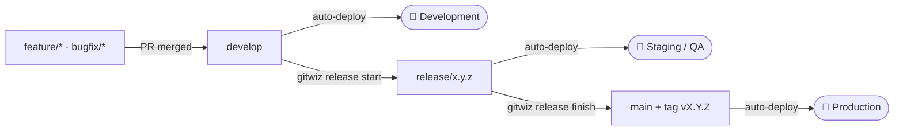
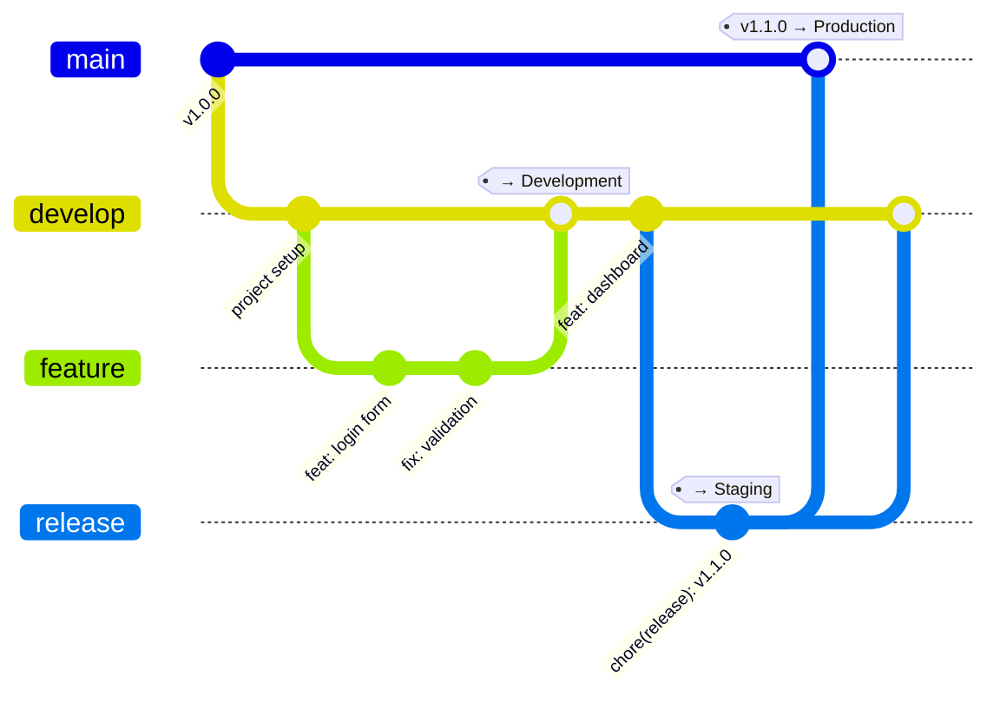
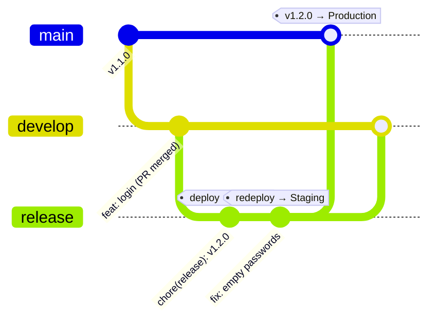

# gitwiz

> Friendly git workflows — interactive wizards for branching, commits, releases, sync, and undo.

**gitwiz** removes the friction of working with git from the terminal. Instead of memorizing commands, you answer simple questions. Every git command gitwiz runs is printed before it executes, so you learn git as you go. The UI speaks **English and Spanish** (auto-detected).

<p align="center">
  
</p>
<p align="center">
  
</p>
<p align="center">
  
</p>

## Install

```bash
npm install -g @fsichi/gitwiz
# or run it without installing:
npx @fsichi/gitwiz status
```

After installing, the command is just `gitwiz` (e.g. `gitwiz status`).

Requires Node.js >= 20 and git. Nothing else — no git-flow binary, no tokens, no setup.

## Commands

Run `gitwiz` on its own (in a terminal) to open an interactive menu listing everything below — handy when you don't remember the exact command. Or call any command directly:

| Command | What it does |
|---|---|
| `gitwiz status` | Where am I and what should I do next? Human-friendly status with suggested next steps. |
| `gitwiz init` | One-time setup: pick your production/work branches and tag prefix. |
| `gitwiz branch` | Start a feature/bugfix/hotfix/refactor branch the right way (updates the base first). |
| `gitwiz commit` | Guided [conventional commit](https://www.conventionalcommits.org): stage files (all at once or pick individually), type, scope, description. |
| `gitwiz sync` | Safely bring the latest changes into your branch (guided merge/rebase, auto-stash). |
| `gitwiz undo` | Undo things without fear: last commit, staged files, local changes — each option explained. |
| `gitwiz stash` | Set changes aside for later with a description, and restore/inspect/delete them safely. |
| `gitwiz release start` | Bump the version (with a suggested bump), generate/update `CHANGELOG.md`, open a release branch. |
| `gitwiz release finish` | Merge the release, create the tag, push, clean up. |
| `gitwiz update` | Update gitwiz to the latest version (auto-detects npm/yarn/pnpm/bun). |

### `gitwiz status`

The only non-interactive command (safe in scripts/CI). Shows your branch, how far ahead/behind you are, your files grouped by state, and up to 3 suggested next steps.

### `gitwiz branch`

Asks what kind of work you're starting (feature, bugfix, hotfix, refactor, chore, docs), normalizes the name you type, pulls the latest base branch, creates `feature/<name>` and optionally pushes it. Hotfixes branch off your production branch; everything else off your work branch. Uncommitted changes? It offers to stash and bring them along.

### `gitwiz commit`

If nothing is staged it detects your uncommitted changes and lets you choose: **stage everything** and commit, or **pick specific files** from a checkbox list. Then walks you through type → scope → description → breaking change, previews the message, and commits. Messages follow [Conventional Commits](https://www.conventionalcommits.org), which is what powers the automatic changelog.

### `gitwiz sync`

Fetches, shows how far ahead/behind you are of your base branch, and offers plain-English strategies: merge the base into your branch (safe default), rebase (with a clear warning if the branch is shared), or just update your local base. If a conflict happens, it tells you exactly what to do — it never tries to resolve things for you.

### `gitwiz undo`

A menu of safe undos, each showing the exact git command it will run. Destructive options ask twice and mention `git reflog` as the escape hatch. If the last commit is already pushed, it offers a `git revert` instead of rewriting history.

### `gitwiz stash`

A friendly face for `git stash`: save your current changes with a description ("so future-you recognizes them"), then restore, inspect, or delete saved stashes from a menu. Restoring offers both flavors — bring it back and remove it from the list (`pop`), or keep a copy (`apply`).

### `gitwiz update`

Checks for the latest version of gitwiz and updates it. Auto-detects your package manager (npm, yarn, pnpm, bun) or force one with `--npm`, `--yarn`, `--pnpm`, or `--bun`. gitwiz also checks for updates in the background when you run any command — if a new version is available, you'll see a notification at the end of the output.

### `gitwiz release`

`release start` checks nothing else is mid-release, updates your work branch, creates `release/<version>`, bumps `package.json` (and `package-lock.json`), and generates the changelog section from your conventional commits since the last tag — with compare/commit links when your remote is GitHub or GitLab. It also **suggests the bump** from those commits (any breaking change → major, any `feat` → minor, otherwise patch). Review it, then `release finish` merges it back (`--no-ff`), tags `v<version>`, pushes, and deletes the release branch.

Not an npm project? No problem — without a `package.json` the current version is read from the latest release tag, so Python/Go/.NET repos can release too (the tag carries the version).

The changelog merge is structural: your existing `CHANGELOG.md` preamble (badges, custom intro) is preserved verbatim, old releases are kept, and re-running the same version replaces its section instead of duplicating it. CRLF files stay CRLF.

## Development workflow

gitwiz is built around a simple branch model:

- **`main`** — production. Only release-quality, tagged code lands here.
- **`develop`** — integration. Day-to-day work merges here before it ships.

Work branches are created from `develop` (except `hotfix/`, which branches from `main` to patch production fast). If you prefer **trunk-based** development, set `developBranch` to the same value as `mainBranch` and everything below still works with a single branch.

### Which command do I use?

| Situation | Command |
|---|---|
| First time setting up gitwiz in a repo | `gitwiz init` |
| Starting **any** new work (feature, fix, refactor, chore, docs) | `gitwiz branch` |
| Saving progress as you work | `gitwiz commit` |
| Ready to open a Pull Request | `git push` → open the PR on GitHub |
| `develop` moved while your PR is open | `gitwiz sync` |
| Not sure what's going on / what to do next | `gitwiz status` |
| Made a mistake (bad commit, wrong files, dirty tree) | `gitwiz undo` |
| Time to ship what's on `develop` | `gitwiz release start` → review → `gitwiz release finish` |
| Updating gitwiz itself | `gitwiz update` |

### Step by step

1. **Start a branch** — `gitwiz branch`. Pick the kind of work:
   - `feature/`, `bugfix/`, `refactor/`, `chore/`, `docs/` branch off **`develop`**.
   - `hotfix/` branches off **`main`** (urgent production fix).

   gitwiz updates the base branch first, then creates yours and (optionally) pushes it.

2. **Commit as you go** — `gitwiz commit`. It writes [Conventional Commits](https://www.conventionalcommits.org) like `feat:`, `fix:`, `refactor:`. This isn't just style — the commit **type** is what builds your changelog and decides the next version number.

3. **Open a Pull Request** — push your branch (`git push`) and open the PR on GitHub (the push output prints a link). Your team reviews it; on approval it merges into **`develop`**. gitwiz deliberately doesn't manage PRs — GitHub already does that well. gitwiz hands off here and picks back up at release time.

4. **Stay in sync** — if `develop` moves while your PR is open, `gitwiz sync` brings those changes into your branch safely (guided merge or rebase, with auto-stash).

5. **Cut a release** — when `develop` has accumulated enough shipped work:
   - `gitwiz release start` — choose the bump based on what changed since the last release:
     - only `fix:` commits → **patch** (`1.2.3 → 1.2.4`)
     - any `feat:` → **minor** (`1.2.3 → 1.3.0`)
     - a breaking change → **major** (`1.2.3 → 2.0.0`)

     It bumps `package.json`, regenerates `CHANGELOG.md` from your commits, and opens a `release/x.y.z` branch.
   - **Review** the generated changelog, run final QA, and commit any last fixes to the release branch.
   - `gitwiz release finish` — merges the release back, creates the `vX.Y.Z` tag, and pushes. If your CI publishes on tags (see below), the new version ships automatically.

6. **`gitwiz status`** — run it anytime; it tells you where you are and suggests the next step.

### Environments

The branch model maps cleanly onto three deploy environments — wire each branch to one in your CI and deploys happen automatically:

| Environment | Deploys from | Updated when |
|---|---|---|
| 🧪 **Development** | `develop` | a PR is merged into `develop` |
| 🔬 **Staging** (QA / UAT) | `release/x.y.z` | you run `gitwiz release start` |
| 🚀 **Production** | `main` + tag `vX.Y.Z` | you run `gitwiz release finish` |

The `release/x.y.z` branch **is** your release candidate, so it's exactly what Staging should run while you do final QA. For Production to track `main`, set `"release": { "alsoMergeToMain": true }` so `release finish` merges into `main` (the default tags on `develop` and leaves `main` for you to deploy manually).



### What command goes where


### The branch model over time



*(`feature` stands in for `feature/login`, `release` for `release/1.1.0`. The tags show where each step deploys. This assumes `alsoMergeToMain: true` so releases land on `main`; a `hotfix/` would branch off `main` instead of `develop`.)*

### Fixing a bug found during a release

Once `gitwiz release start` has created `release/x.y.z` and deployed it to Staging, QA may find a bug that must ship in **this** release. The fix goes **on the release branch itself** — not on a new branch off `develop`. `gitwiz release finish` then carries it back into `develop` (and `main`), so you write the fix once and it lands everywhere.

Say you're releasing **1.2.0** (a login feature) and QA finds that login accepts empty passwords:

1. You're already on `release/1.2.0` after `release start`. Fix the code, then commit it **to the release branch**:
   ```bash
   gitwiz commit          # fix(auth): reject empty passwords
   git push               # re-deploys release/1.2.0 to Staging
   ```
2. QA re-tests on Staging and approves.
3. `gitwiz release finish` merges `release/1.2.0` into `develop` **and** `main`, tags `v1.2.0`, and deletes the branch.

Result: production (`main`) and `develop` both have the login feature **and** the fix — so the bug can't reappear in future work. You never had to apply the fix in two places.



**Where does a fix go?**

| Situation | Put the fix on |
|---|---|
| Bug in the release you're stabilizing (found in Staging) | the `release/x.y.z` branch → `finish` carries it to `develop` + `main` |
| Unrelated feature/fix while a release is open | a normal `gitwiz branch` off `develop` (ships in the *next* release) |
| Bug already live in production (no open release) | a `hotfix/` branch off `main` |

> If `develop` moved on while the release was open, the `release finish` merge into `develop` may surface conflicts — gitwiz shows them with step-by-step instructions instead of failing silently.

## Configuration

Run `gitwiz init`, or create `.gitwizrc.json` at your repo root (a `"gitwiz"` key in `package.json` also works):

```json
{
  "mainBranch": "main",
  "developBranch": "develop",
  "tagPrefix": "v"
}
```

Without config, gitwiz auto-detects your branches (`main`/`master`, `develop`/`development`/`dev`). If there is no work branch, it operates trunk-based on your main branch.

<details>
<summary>All options (with defaults)</summary>

```jsonc
{
  "mainBranch": "main",          // production branch
  "developBranch": "develop",    // where work branches start; same as mainBranch = trunk-based
  "tagPrefix": "v",              // release tags: v1.2.3 ("" for bare 1.2.3)
  "language": "auto",            // wizard language: "en", "es" or "auto" (system locale)
  "protectedBranches": ["main", "develop"], // gitwiz commit warns/refuses on these
                                 // default: [mainBranch, developBranch] when distinct, [] in trunk mode
  "branchTypes": [               // extends/overrides the defaults (merged by "type")
    { "type": "feature", "prefix": "feat/" },          // override one field of a default
    { "type": "spike" },                               // add a new type (prefix defaults to "spike/")
    { "type": "docs", "hidden": true }                 // remove a default type
  ],
  "commitTypes": [               // extends/overrides the defaults (merged by "type")
    { "type": "ci", "changelogSection": "CI" },        // make ci commits show in the changelog
    { "type": "wip", "description": "Work in progress" }
  ],
  "release": {
    "alsoMergeToMain": false,    // true: release finish also merges into mainBranch
    "changelogFile": "CHANGELOG.md"
  }
}
```

`branchTypes` and `commitTypes` **merge with the built-in defaults** — declare only what you change. Entries match by `type`: existing types are overridden field-by-field, unknown types are added, and `"hidden": true` removes one.

</details>

### Language

The wizards speak English and Spanish. By default gitwiz follows your system locale; pin it per repo with `"language": "es"` (or `"en"`) in the config, or force it for one run with the `GITWIZ_LANG` environment variable. File output (CHANGELOG.md, AGENTS.md) is always English.

## Working with AI agents

gitwiz plays well with AI coding assistants (Claude Code, Cursor, Copilot, …) in two ways.

### 1. Teach the agent your workflow

`gitwiz init` offers to write an **`AGENTS.md`** with a managed block describing this repo's branch model, commit conventions, and the exact commands to run — generated from your config, so it always matches your real setup. Re-running `init` updates just that block (between `<!-- gitwiz:start -->` / `<!-- gitwiz:end -->`) without touching the rest of the file.

### 2. Non-interactive commands

The wizards are for humans, but every workflow command also takes flags so an agent (or CI) can run it **without prompts** — a bare command in a non-TTY context fails fast instead of hanging:

```bash
gitwiz branch --type feature --name add-login      # add --push to publish it
gitwiz commit --type feat --scope auth -m "add login form"
gitwiz commit --type fix -m "handle null user" --all          # --all stages everything
gitwiz commit --type feat -m "new api" --breaking "v1 removed"
gitwiz release start --minor                        # or --patch / --major / --version 1.4.0
gitwiz release finish --yes
gitwiz status                                       # read-only, always safe
```

`gitwiz commit` runs non-interactively as soon as `--type` and `-m` are given; `gitwiz branch` when `--type` and `--name` are given.

Committing to a **protected branch** (`main`/`develop` by default) fails fast in non-interactive mode — agents should create a work branch first. `--allow-protected` overrides when it's genuinely intended.

## Why gitwiz?

- **Zero prerequisites** — plain git underneath. No git-flow binary, no global config.
- **Educational** — every mutating git command is echoed before running (`--verbose` echoes the read-only ones too).
- **Safe by default** — destructive actions double-confirm, pushed commits get revert suggestions, conflicts come with step-by-step instructions.
- **Windows-first class** — no shell interpolation anywhere; arguments go to git verbatim. Tested on Windows, macOS and Linux.
- **Bilingual** — wizards in English or Spanish, following your system locale.
- **Tiny** — 4 runtime dependencies, fast `npx` startup.
- **Always up to date** — checks for new versions in the background and notifies you; update with `gitwiz update`.

## License

MIT © Facundo Sichi
